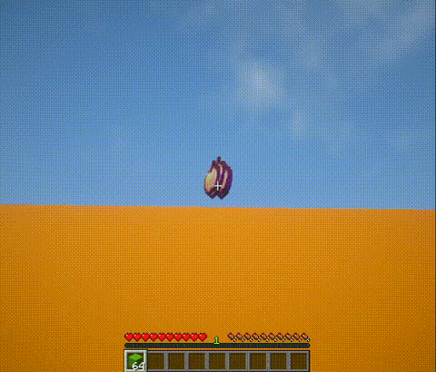
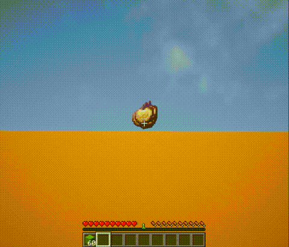

# JBlockGlitch

JBlockGlitch is a small Paper plugin that prevents players from using denied
block placements to climb through WorldGuard-protected regions.

Download: https://modrinth.com/plugin/jblockglitch

Contribute: https://github.com/jruk8/JBlockGlitch

## Requirements

- Paper 26.2
- Java 25
- WorldGuard 7.0.17
- WorldEdit, installed as a WorldGuard dependency

When WorldGuard denies a block placement, the plugin immediately resends the
real block state to the player and briefly prevents the upward movement that
can otherwise be triggered by the client-side ghost block.

## Demonstration without the fix

This 10-second demonstration shows the block-placement glitch before
JBlockGlitch is installed.

## Demonstration with the fix

This 10-second demonstration shows the same placement attempt with
JBlockGlitch installed.

## Commands

| Command | Permission | Notes |
| --- | --- | --- |
| `/jblockglitch:help` | `jblockglitch.help` | Shows basic plugin documentation. |
| `/jbg` | `jblockglitch.help` | Short alias for `/jblockglitch:help`. |
| `/jblockglitch:reload` | `jblockglitch.reload` | Reloads `config.yml` and `messages.yml`. |

The help message is configured in `messages.yml` as a multiline list. Messages
use MiniMessage formatting by default. Set `text-format: legacy` in
`config.yml` to use legacy `&` color codes instead.

`Config.yml` provides options for changing detection mode between `strict` and `medium`. Default is strict. If experiencing issues with strict, you should try changing to medium.

See [CONTRIBUTING.md](CONTRIBUTING.md) for build instructions and contributor
setup.

© 2026 jruk8. Licensed under GNU GPLv3.
