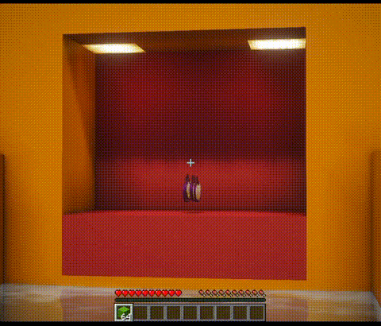

# JBlockGlitch

JBlockGlitch is a lightweight Paper plugin that prevents players
from creating ghost items and from block glitching in protected
regions.

Download: https://modrinth.com/plugin/jblockglitch

Contribute: https://github.com/jruk8/JBlockGlitch

## Protected-block glitch prevention

When a protection plugin rejects a block placement, such as WorldGuard or
GriefPrevention, JBlockGlitch resends the real block state to the player and
prevents movement through the client-side ghost block.

The plugin supports both normal block placements and bucket-based placements,
including water, lava, and powder snow. Bucket protection uses multiple event
paths to support protection plugins that handle bucket interactions differently.

Two detection modes are available:

- `medium` rubberbands the player to their previous position when a denied
  placement is detected.
- `strict` uses additional movement and position detection to prevent the
  player from standing inside or moving through a denied block.

## Vanilla ghost item and ghost block prevention

JBlockGlitch detects common vanilla ghost item creation techniques, such as
inventory manipulation involving F+Q, hotbar switching, dropping items, and
block placement.

Three detection modes are available:

- `medium` detects common ghost item manipulation patterns.
- `hard` additionally monitors inventory manipulation events, including
  creative-mode inventory interactions.
- `brute-force` continuously resynchronizes player inventories.

JBlockGlitch can also periodically resynchronize the blocks immediately
surrounding each player. This helps correct client-side ghost blocks created
through client modifications that never result in a server-side block
placement event.

The block resynchronization checks an 18-block area around the player,
covering a 3×3×2 region containing the player's feet and head space. The
interval is configurable and can be disabled independently.

# Requirements

- Paper 26.x (tested on 26.2+)
- Java 25

# Demos

Plugin configured to `medium` detection mode. Tests done with autoclicker at 100 CPS.

## Protected Region

### Without the plugin

This 10-second demonstration shows the block-placement glitch before
JBlockGlitch is installed.

### With the plugin

This 10-second demonstration shows the same placement attempt with
JBlockGlitch installed.

## Vanilla Ghost Item

### Without the plugin

This 10-second demonstration shows ghost item generation before
JBlockGlitch is installed.

### With the plugin

This 10-second demonstration shows the ghost item generation
failing after JBlockGlitch is installed.

# Commands

| Command | Permission | Notes |
| --- | --- | --- |
| `/jblockglitch help` | `jblockglitch.help` | Shows basic plugin documentation. |
| `/jblockglitch reload` | `jblockglitch.reload` | Reloads `config.yml` and `messages.yml`. |
| `/jbg` | `jblockglitch.help` | Short alias for `/jblockglitch`. |

The help message is configured in `messages.yml` as a multiline list. Messages
use MiniMessage formatting by default. Set `text-format: legacy` in
`config.yml` to use legacy `&` color codes instead.

`Config.yml` provides independent options for protected-block detection,
ghost-item detection, and nearby ghost-block resynchronization.

If issues occur, regenerate all configuration files and download the latest
version. If the issue persists, report it to the issue tracker.

See [CONTRIBUTING.md](CONTRIBUTING.md) for build instructions and contributor
setup.

© 2026 jruk8. Licensed under GNU GPLv3.
